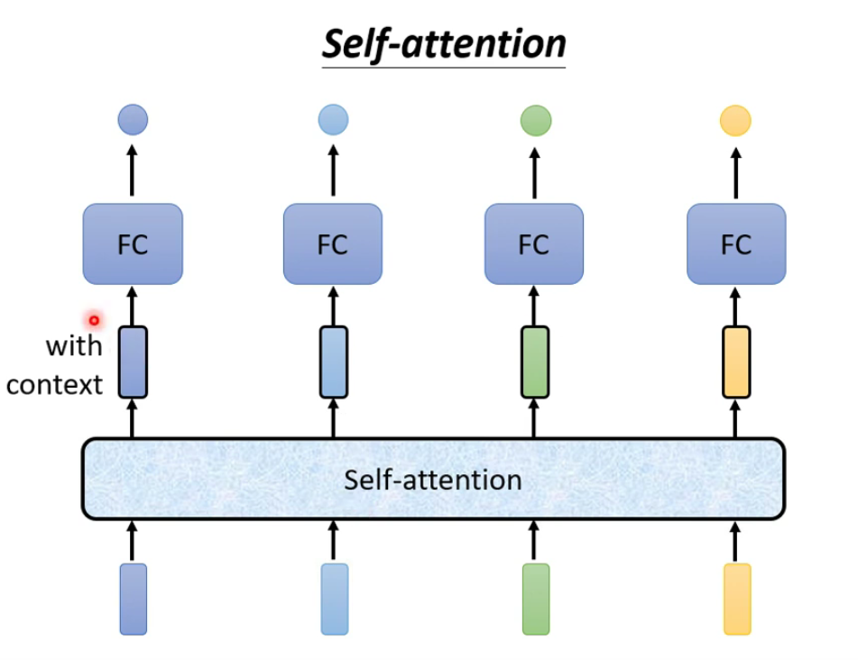
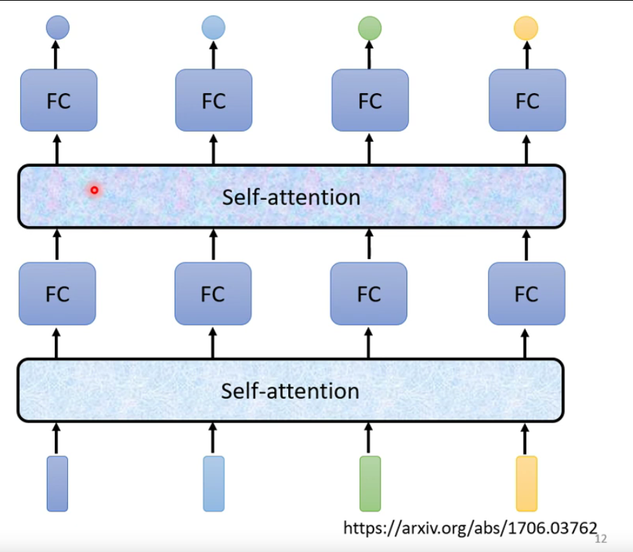

## 背景

之前用在NLP上，现在又用到语音、CV上，推荐场景也有用到。
面试考了几次，我最近甚至仍有答错之处，那行，我彻底花点时间来整理一下，尽管网上有N多博客，N多解读，但看了好多，仍然没有彻底攻下，所以我还是以输出倒闭输入来完成对知识的吸收和理解。

*（我会慢慢一轮一轮地补充的）*

## 模型详解

### 相关资源推荐

transformer是在论文*《Attention is all you need》*里面把self-attention发扬光大，说实话，该文其实对新手非常不友好，强烈推荐两个资源：[李沐Transformer论文逐段精读](https://www.bilibili.com/video/BV1pu411o7BE?spm_id_from=333.999.0.0)、[台大李宏毅自注意力机制和Transformer详解](https://www.bilibili.com/video/BV1v3411r78R?p=1)。
ps: *李宏毅的课程ppt可以在其[主页](https://speech.ee.ntu.edu.tw/~hylee/ml/2021-spring.html)下载*——[self-attention课件](https://speech.ee.ntu.edu.tw/~hylee/ml/ml2021-course-data/self_v7.pdf)，[transformer课件](https://speech.ee.ntu.edu.tw/~hylee/ml/ml2021-course-data/seq2seq_v9.pdf)

一开始不可能深入代码细节，我当初看论文的时候也看得云里雾里，看了N多博客也似懂非懂，所以还是从看最好的资源入手。

### self-attention 

#### input output

如何把把一个词汇表示成一个向量呢，最简单做法是**One-hot Encoding**，这种做法没有包含语义信息，比如，cat分别和dog、apple做点积，结果都是0，但从语义上来说，cat和dog应该是更接近的，另外一种做法是用**Word Embedding**，先挖个坑。

可以作为input的东西很多，如语言，语音(10ms用某种方法采样为一个向量)，分子

输入和输出的长度:
输入为N，输出为N，输出如果是一个数字，那就是回归问题，如果是一个label，那就是分类问题。如**POS tagging问题(词性标注)**。
输入为N，输出为1，如根据一段话，判断是谁说的；或者输入一个分子，判断是否有毒性。
输入为N，输出不确定，由机器自己决定，如翻译任务，**seq2seq任务**。

输入输出等长，又叫Sequence Labeling问题。要注意，输入一排向量，长度是不确定的。
*fully connected这里没搞懂，参数共享不，再挖个坑*

#### 结构 

self-attention + FC可以叠加多个

## 代码细节

*待续......*

## 常见面试问答
